# CHEATSHEET — Mermaid (Diagrams in Markdown)

## What is Mermaid?
Mermaid lets you write diagrams as text inside Markdown.

**Core idea:** put Mermaid code inside a fenced code block:

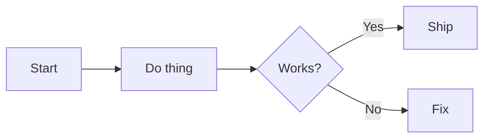

---

## Where it usually works
Mermaid often renders in:
- Markdown files (`README.md`, `/docs/*.md`)
- Issues / PR descriptions / comments (depends on platform/settings)

**If it doesn’t render:** copy the code into the Mermaid Live Editor (search “Mermaid Live Editor”) or use a screenshot in `/docs/images/`.

---

## Syntax basics (you’ll use these constantly)

### 1) Code block
Use **exactly** ` ```mermaid `:

````

````

### 2) Directions
- `TB` top-to-bottom
- `LR` left-to-right
- `RL` right-to-left
- `BT` bottom-to-top

Example:
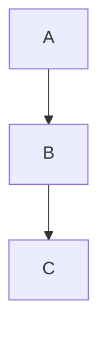

### 3) Node shapes
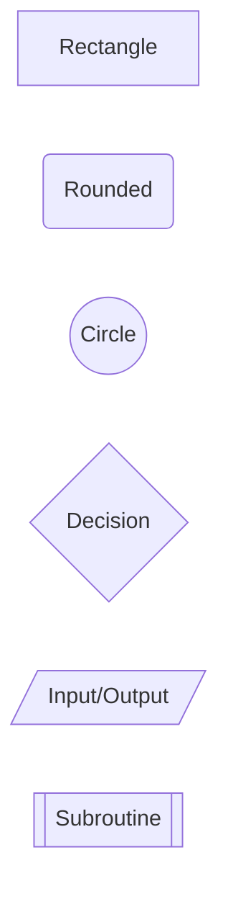

### 4) Arrows + labels
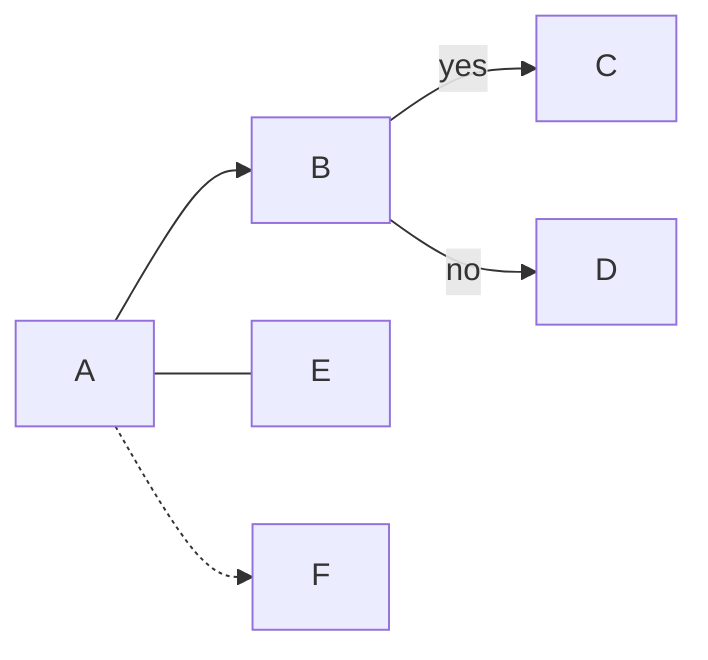

### 5) Subgraphs (group boxes)
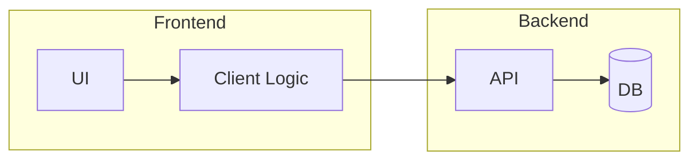

### 6) Comments


---

## Diagram types you’ll actually use in Capstone

## 1) Flowcharts (process + logic)
**Use for:** user flows, “what happens when”, setup steps, CI flow.

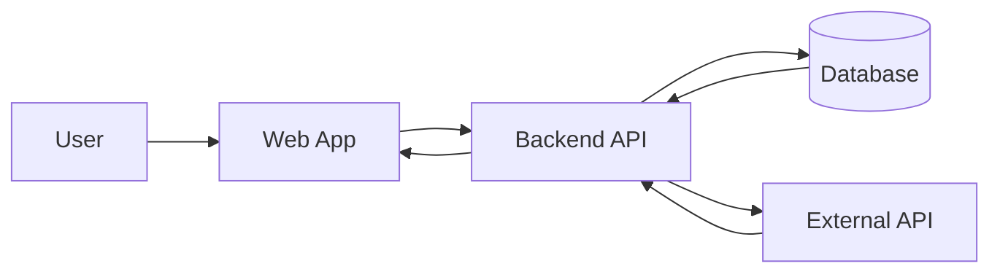

---

## 2) Sequence diagrams (API calls + timing)
**Use for:** request/response flows, login, payments, chatbot calls.

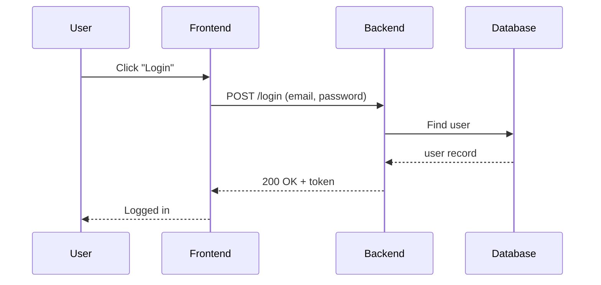

---

## 3) ER diagrams (database tables)
**Use for:** database planning, schema sanity checks.

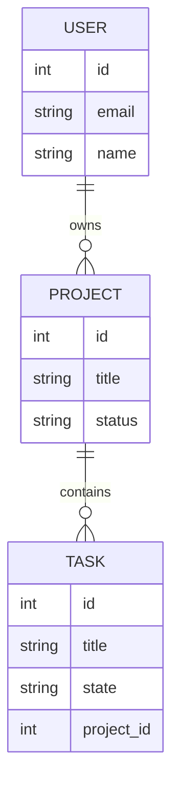

---

## 4) Gantt charts (sprint planning)
**Use for:** high-level roadmap, milestones.

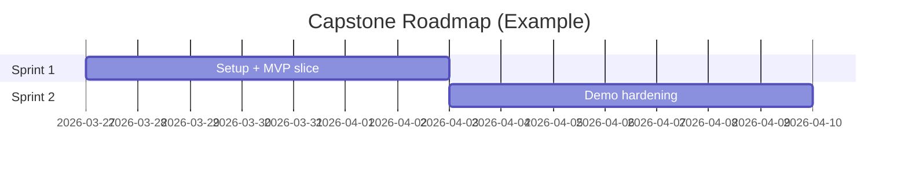

---

## 5) State diagrams (feature states)
**Use for:** UI states, onboarding flows, game states.

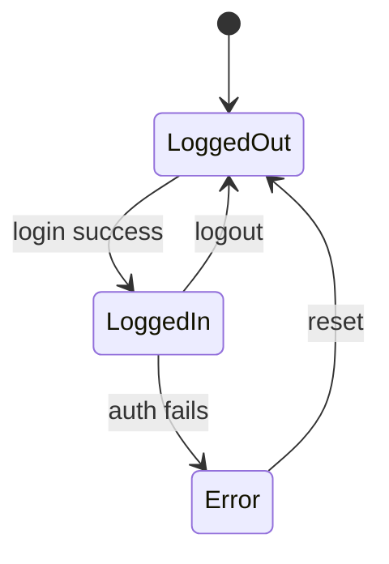

---

## Capstone copy/paste templates

### A) C4-lite architecture (super simple)
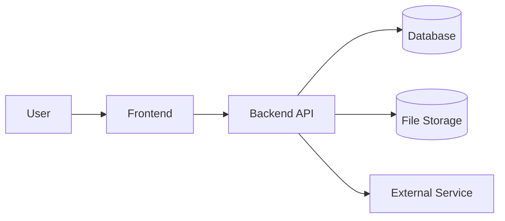

### B) Weekly demo flow (what you show)
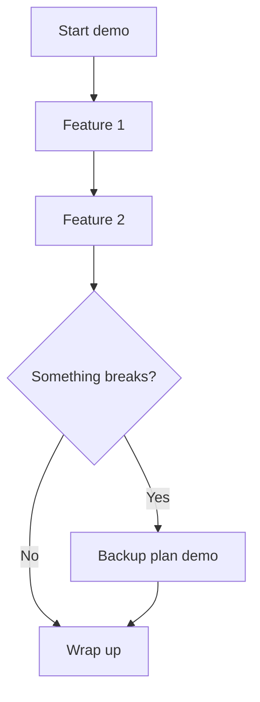

### C) CI pipeline (if you add Actions later)
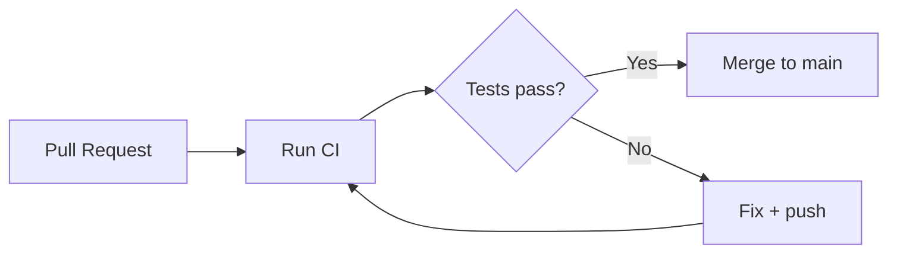

---

## Styling (optional, use lightly)
If you want basic styling:

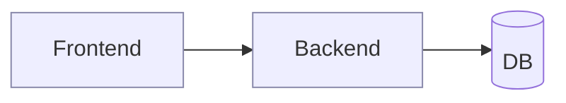

If styling causes render issues, remove it. Clarity > pretty.

---

## Common mistakes (and fixes)
- **Doesn’t render:** confirm the fence is ` ```mermaid `.
- **Indentation weird:** Mermaid is picky. Keep formatting simple.
- **IDs with spaces break:** use `A1`, `backend_api`, etc. Put spaces in labels like `[Label with spaces]`.
- **Unreadable:** switch to `LR`, use subgraphs, or split into two diagrams.

---

## Definition of Done for a Mermaid diagram
- It answers one question (architecture OR flow OR schema)
- It fits on one screen
- Labels use plain English
- It matches reality (no fantasy boxes)

